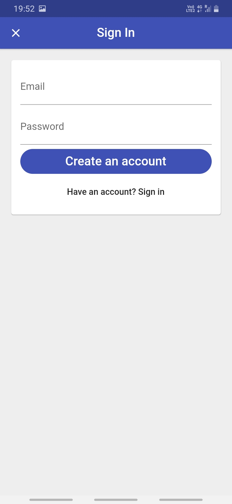
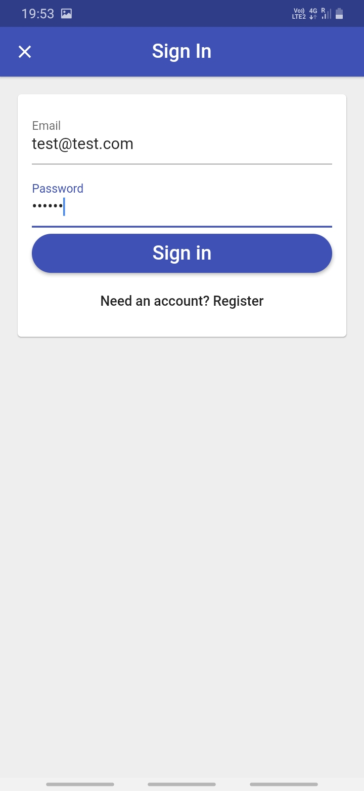
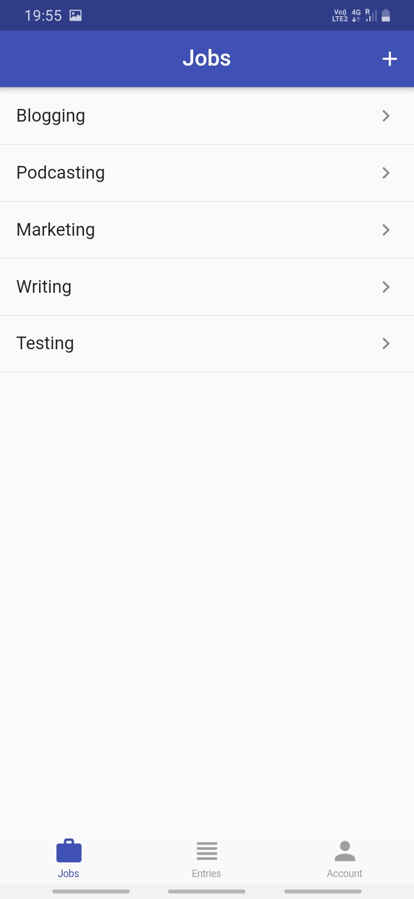
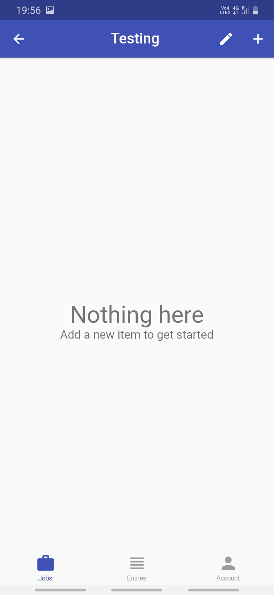
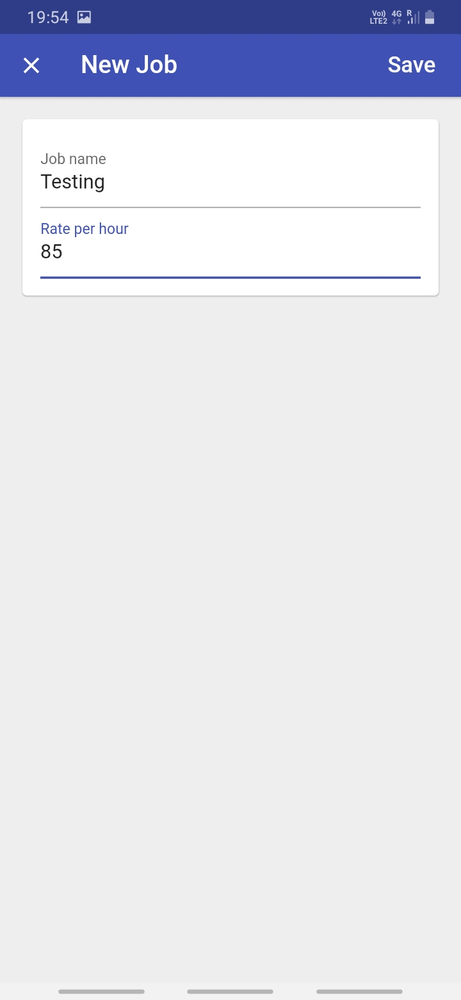
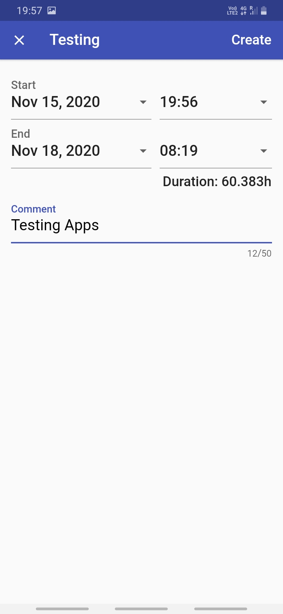
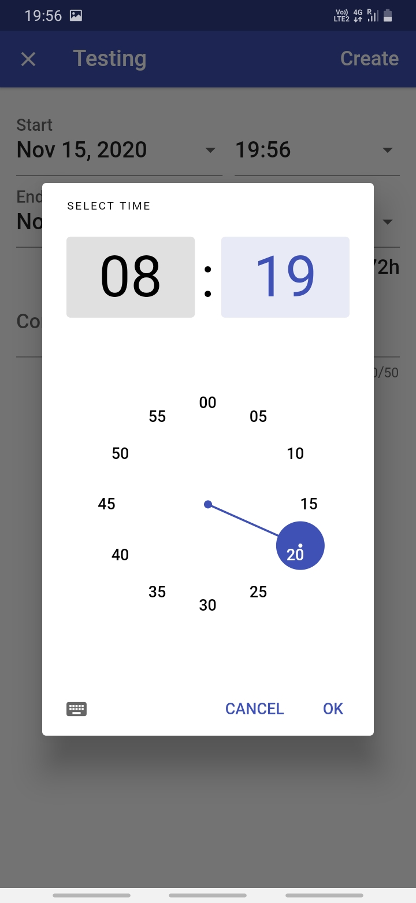
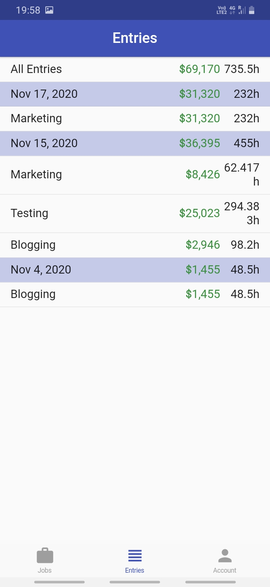
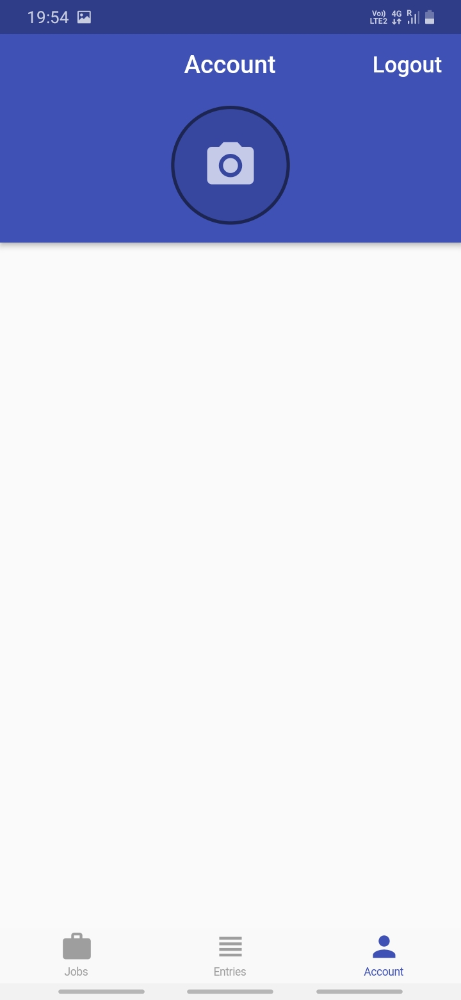

# 💡 Google,Facebook,Email and Anonymous Login

Easy time tracking, keep track of your budget, handles new addition of job track and store all jobs 
tracking information in firestore.

## 👀 Samples:

 &nbsp;&nbsp;&nbsp;&nbsp;  &nbsp;&nbsp;&nbsp;&nbsp; &nbsp;&nbsp;&nbsp;&nbsp; 

 &nbsp;&nbsp;&nbsp;&nbsp;  &nbsp;&nbsp;&nbsp;&nbsp; &nbsp;&nbsp;&nbsp;&nbsp; 

 &nbsp;&nbsp;&nbsp;&nbsp;  &nbsp;&nbsp;&nbsp;&nbsp; &nbsp;&nbsp;&nbsp;&nbsp; 

 &nbsp;&nbsp;&nbsp;&nbsp; 

## 🕓 Features:

✅ Firebase Authentication (anonymous, email & password, Google, Facebook)
✅ State Management: how to use setState, lifting state up via callbacks, global access, scoped access    with Provider, BLoCs, ValueNotifier & ChangeNotifier
✅ Streams, building reactive apps & advanced stream operations with RxDart
✅ Forms, input handling and validation
✅ Databases and Cloud Firestore
✅ Working with Forms and Cloud Firestore
✅ Working with ListViews and multiple UI states
✅ Date & time pickers
✅ Navigation

Managing and updating packages

