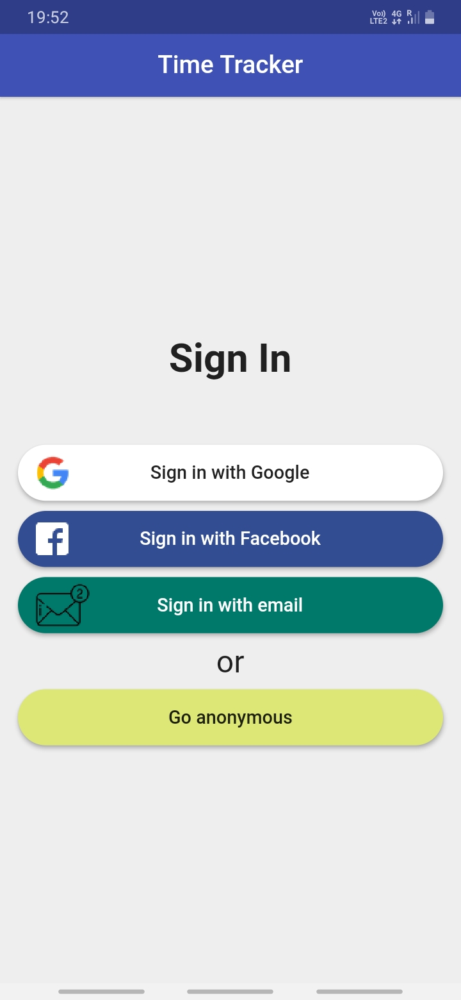

# 💡 Google,Facebook,Email and Anonymous Login

Easy time tracking, keep track of your budget, handles new addition of job track and store all jobs 
tracking information in firestore.

## 👀 Samples:

 &nbsp;&nbsp;&nbsp;&nbsp;  &nbsp;&nbsp;&nbsp;&nbsp; &nbsp;&nbsp;&nbsp;&nbsp; 

 &nbsp;&nbsp;&nbsp;&nbsp;  &nbsp;&nbsp;&nbsp;&nbsp; &nbsp;&nbsp;&nbsp;&nbsp; 

 &nbsp;&nbsp;&nbsp;&nbsp;  &nbsp;&nbsp;&nbsp;&nbsp; &nbsp;&nbsp;&nbsp;&nbsp; 

 &nbsp;&nbsp;&nbsp;&nbsp; 

## 🕓 Features:

- ✅ Firebase Authentication (anonymous, email & password, Google, Facebook)
- ✅ State Management: how to use setState, lifting state up via callbacks, global access, scoped access    with Provider, BLoCs, ValueNotifier & ChangeNotifier
- ✅ Streams, building reactive apps & advanced stream operations with RxDart
- ✅ Forms, input handling and validation
- ✅ Databases and Cloud Firestore
- ✅ Working with Forms and Cloud Firestore
- ✅ Working with ListViews and multiple UI states
- ✅ Date & time pickers
- ✅ Navigation

## 🔮 Packages Used
Packages Name        | Usage       
:-------------------------|-------------------------
|[firebase_auth](https://pub.dev/packages/firebase_auth) | Authentication
|[google_sign_in](https://pub.dev/packages/google_sign_in)| Google Authentication
|[flutter_facebook_login](https://pub.dev/packages/flutter_facebook_login) | Facebook Login
|[provider](https://pub.dev/packages/provider)| State Management
|[cloud_firestore](https://pub.dev/packages/cloud_firestore) | Flutter plugin for Cloud Firestore
|[rxdart](https://pub.dev/packages/rxdart) |  Adds additional capabilities to Dart Streams and StreamControllers
|[intl](https://pub.dev/packages/intl) | Datetime Handling

## 🤝 Contributions

Contributions, issues and feature requests are welcome !
Feel free to check.